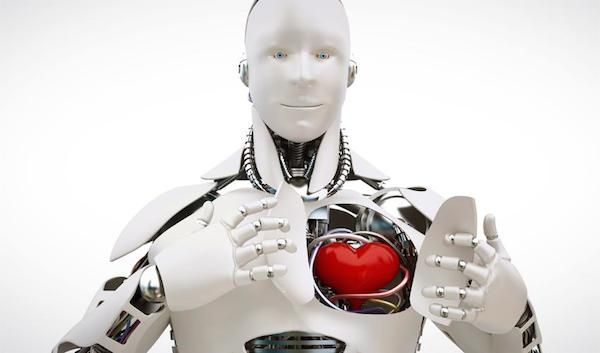

## 
 Reseña del libro "La Revolución Transhumanista: Cómo la Tecnomedicina y la Uberización del Mundo van a Transformar Nuestras Vidas"

La revolución transhumanista es un libro escrito por [Luc Ferry]https://es.wikipedia.org/wiki/Luc_Ferry en el año 2019.***Luc Ferry*** es un profesor, filósofo e intelectual; también ha sido ministro de educación e investigación en Francia y miembro del Consejo Económico y Social francés. -La revolución transhumanista 

 

 A grandes rasgos el libro nos explica lo que es el **transhumanismo**, nos lo describe como un movimiento, principalmente intelectual y científico, pero con un gran potencial para extenderse hasta el ambito político, social y económico.Este movimiento se apoya en el uso de las **NBIC**, ***Nanotecnología,Biotecnología,Informática,Cognitivismo***, para lograr mejoras directas en el ser humano, englobando desde mejoras físicas, como el uso de protesis o aparatos, hasta el alterar el genoma humano para incrementar la capacidad intelectual o eliminar el riesgo de contraer enfermedades hereditarias.

###Podemos dividir a este movimiento en 2 grandes ramas:
1. Por un lado tenemos a aquellos científicos que apoyan el movimiento y creen firmemente en que el uso de estas tecnologías ayudaria de manera positiva al mejoramiento de las capacidades humanas, es importante recalcar que para ellos siempre se trabaja sobre el ser humano en escencia.

2. Por el otro lado tenemos a aquellos científicos que no solo creen en la mejora del ser humano, si no que defienden la creacion de una nueva especie: un hibrido entre hombre y humano.

En el libro se nos hace mención de como este movimiento de una manera regulada y legal puede llegar a tener un impacto completamente positivo dentro de esta sociedad. También menciona, a mi parecer lo más importante, que frenar por completo este movimiento perjudicaria más en lugar de dar una solución, pues solo se da paso a un desarrollo clandestino sin ningun tipo de regulazion, donde probablemente las primeras aplicaciones sean para la creación de armas.

Otra cosa de la que nos habla este libro es sobre la ética y moral dentro de esta ideología, pues critica hasta que punto es correcto intervenir en el genoma humano, aunque por otro lado contrasta la información proponiendo que sin duda sería menos ético ignorar una enfermedad cuando se cuentan con los medios necesarios para curarla.

Dentro del ámbito económico nos plantea una economía mucho más colaborativa entre los países, y menciona ciertos avances tecnologícos que causarian inovaciones , desde plataformas que facilitan los pagos, hasta servicios en línea, tales como uber o rappi. Sin embargo también nos muestra que estas innovaciones también pueden llegar a resaltar las desigualdades económicas entre países, e incluso entre clase sociales.

#### En lo personal este libro me gusto mucho, pues explica esta nueva ideología de una manera simple que permite que sea comprensible para cualquier persona, también abarca todos los angúlos y lados de la ideología, positivos, negativos, e incluso menciona las perspectivas políticas, religiosas, morales y espirituales que podrían llegar a hacer frente a este movimiento.

